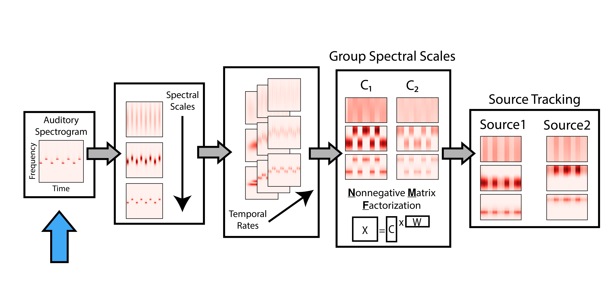
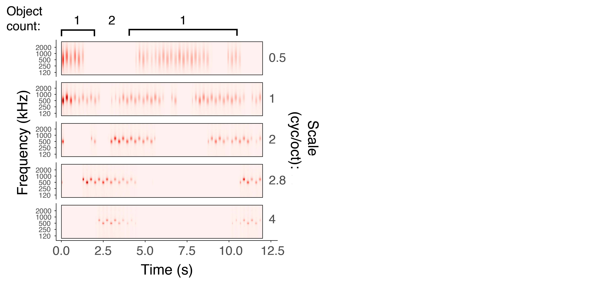

### Objective

---

### Feature-level Analysis

---

### Object-level Analysis

---

### Where Could Bistability Arise?

---

### Bistable Spectrogram

---

### Bistable Scales

---

### Ambiguity in source counting (?)

